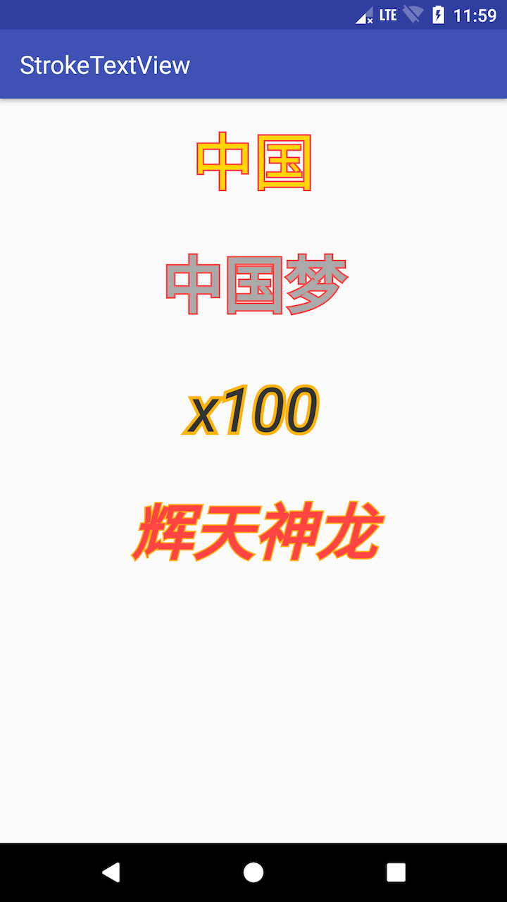

# StrokeTextView

## Demo


## Download
```groovy
compile 'com.github.xch168:stroketextview:1.0.0'
```
## Usage
```xml
<com.github.xch168.stroketextview.StrokeTextView
        android:layout_width="match_parent"
        android:layout_height="100dp"
        android:gravity="center"
        android:textSize="50sp"
        android:textColor="@android:color/darker_gray"
        android:text="中国梦"
        android:textStyle="bold"
        app:stroke_color="@android:color/holo_red_light"
        app:stroke_width="2.5dp"/>
```
